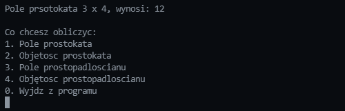

# Code2

  
<h2 style="display: inline-block">Table of Contents</h2>

  <ol>
    <li><a href="#about-the-project">About The Project</a></li>
    <li><a href="#installation">Installation</a></li>
    <li><a href="#usage">Usage</a></li>
    <li><a href="#overview">Overview</a></li>
  </ol>

## About The Project
This is C console program that can calculate area and volume of a rectangle and cuboid. v1.0

## Installation
Download [code2-1.0.tar.gz](https://github.com/jilquero/Code2/raw/main/code2-1.0.tar.gz).

`tar zxvf code2-1.0.tar.gz`

`cd code2-1.0`

`./configure`

`make`

`sudo make install`

## Usage
`Code2`

## Overwiev

